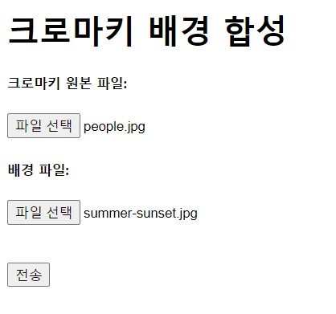
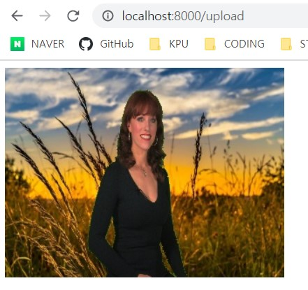

# opencv_project
 opencv로 영상처리를 공부해봅시다.  

 영상 처리를 공부하고 기록합니다.  

 day1 - [jupyter notebook 코드보기](https://github.com/loftmain/opencv_project/blob/master/opencv_day1.ipynb)  
  Opencv로 이미지를 불러오고  
  크로마키사진과 영상으로 실습을 해보고  
  이를 flask 웹에서 처리하는 것을(로컬이지만) 해본다.

day2 - [jupyter notebook 코드보기](https://github.com/loftmain/opencv_project/blob/master/opencv_day2.ipynb)  
 선형변환  
 LUT  
 합성  
 로고 투명처리  
 histogram 스트레칭  
 histogram 평활화  
 histogram을 기반을 전경과 배경 분리 - 이진화  
 => Point 처리  
    한계가 있다.  
